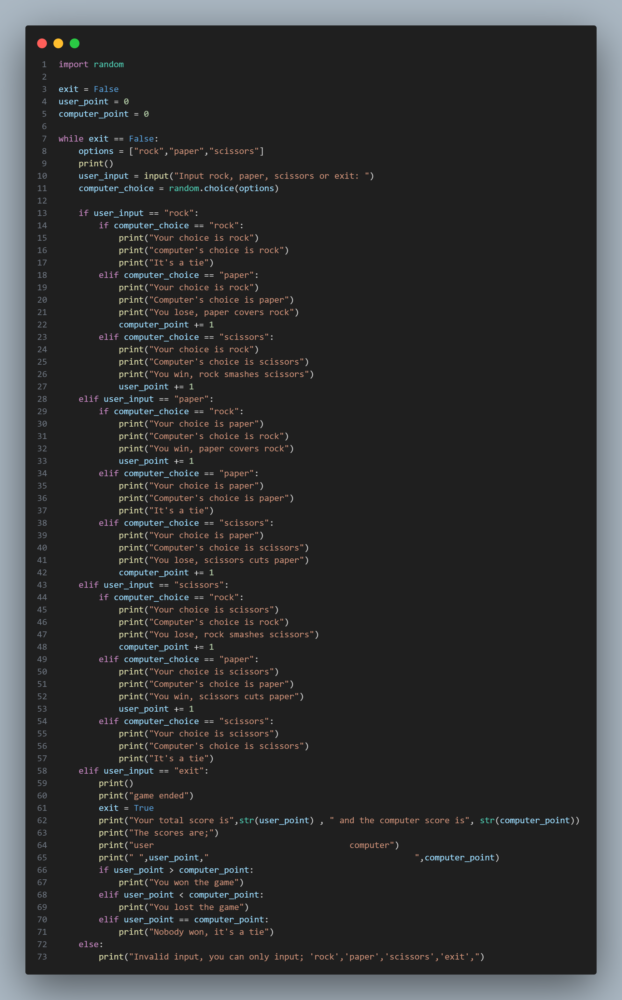

# Rock-paper-scissors

In order to create a game of rock-paper-scissors, you need to follow these steps:

1. import random. Create a var(exit = False), create another var(computer_points = 0), to keep track of the score of the compute's score, then create another var(user_score = 0) to keep track of the user's score. Create a while loop(while exit == False:),Create a var(options = ["rock","paper","scissors"])
2. Create a var(user_input), then inside it put an input(user_input = input("Input rock, paper, scissors or exit: ")), to tell the the user what to do. Create a var(computer_choice = random.choice(options)), for the computer to choose one out of the var(options)
3. Create an if statement(if user_input == "rock"), then put another if statement under the first if statement of if(computer_choice == "rock"), then print(print("Your choice is rock")), then print(print("Computer's choice is rock")), then print(print("it is a tie")), then do that 3 times but with exactly the way the game is played(and use an elif statement)
4. Do everything in number '3.' three times but with how the game is played. Create an if statement(if user_input == "exit":), then print something like(print("Game ended")), then put the var(exit = True), then print something like(print("Your total score is",str(user_point) , " and the computer score is", str(computer_point))). Create an else statement(else: print("invalid input"))

Thats all for the calculator app, if you don't understand, look at the image;